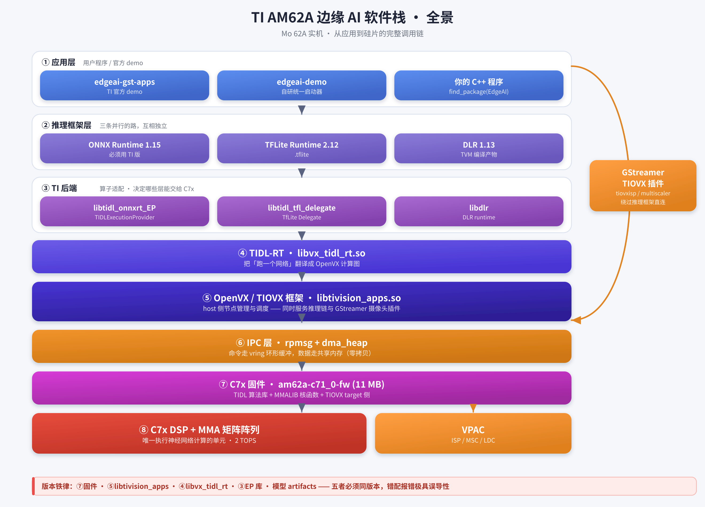
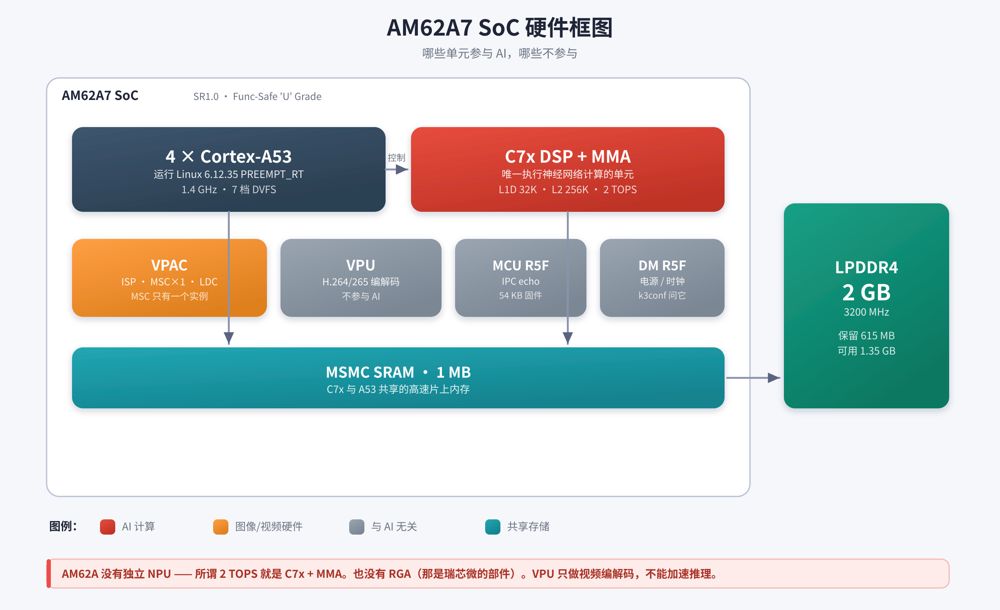
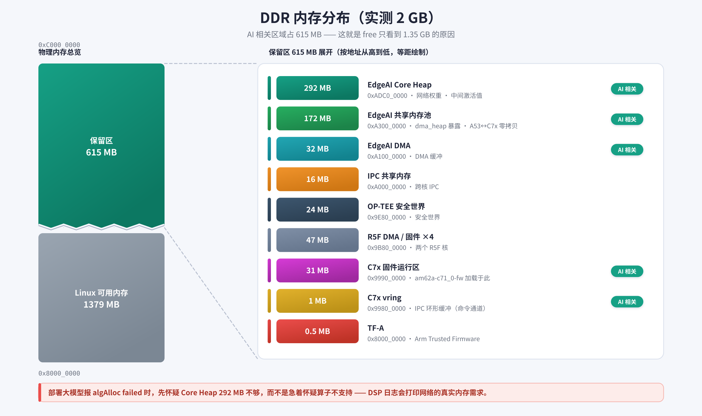
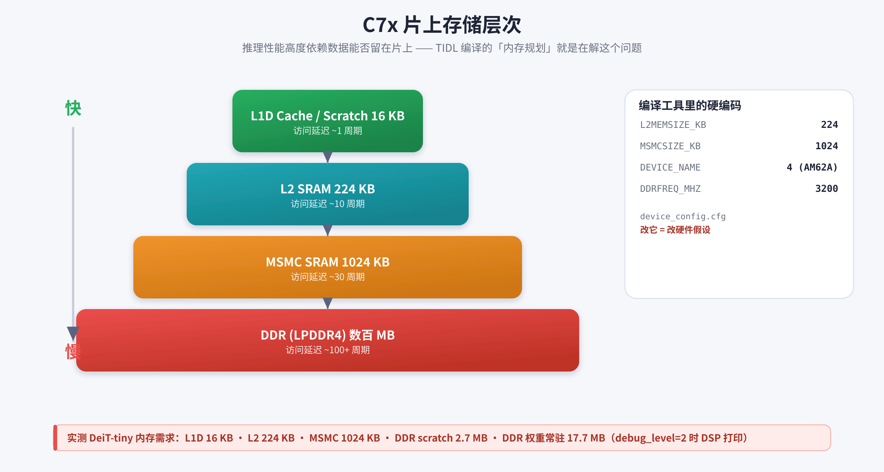
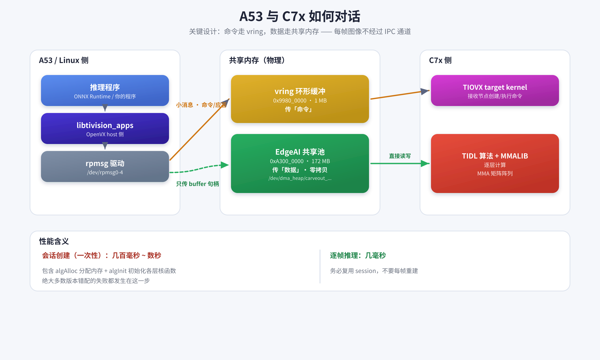
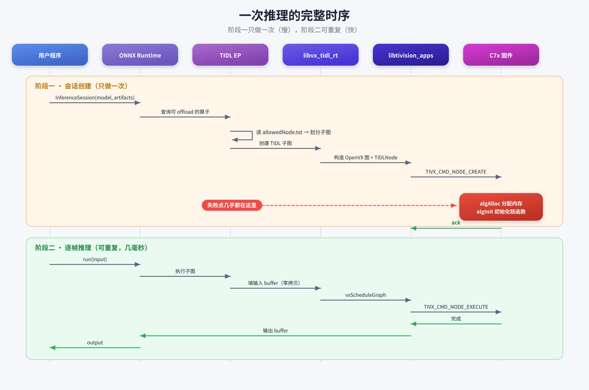
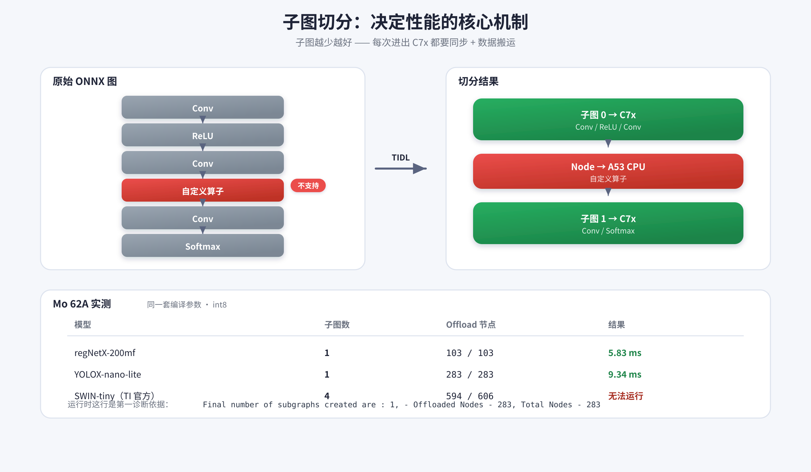
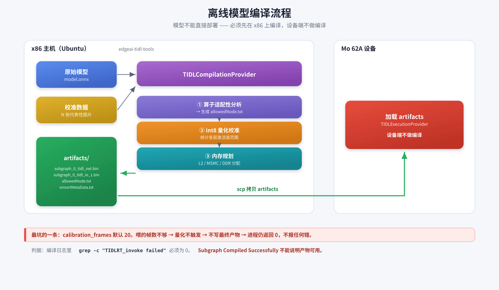
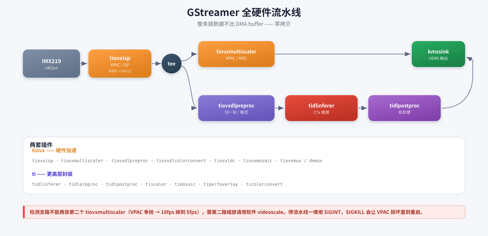
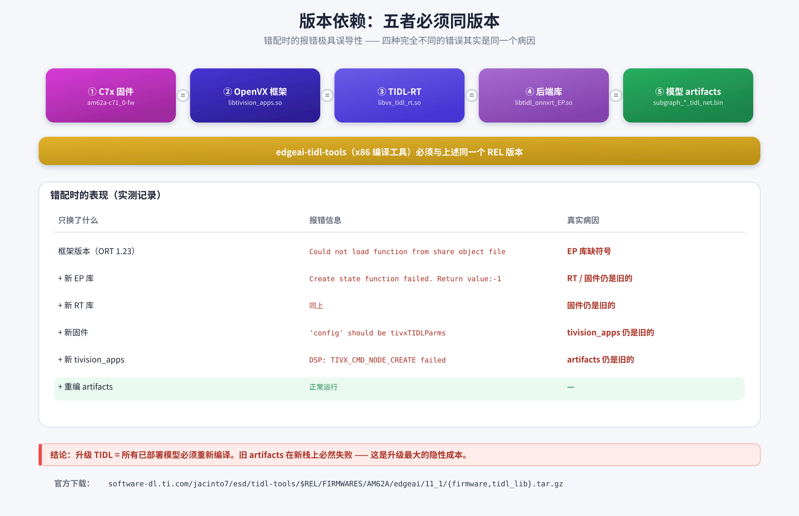

# TI AM62A 边缘 AI 软件栈详解（Mo 62A）

> 本文所有路径、地址、版本号、性能数字均取自 **Mo 62A 实机**
> （AM62Ax SR1.0 / Debian 13 / 内核 6.12.35 PREEMPT_RT），而非官方文档转述。
> 标注 ⚠️ 的位置是实际踩过的坑。
>
> 配图源码见 [`assets/ai-stack/gen_diagrams.py`](assets/ai-stack/gen_diagrams.py)，
> 修改后执行 `python3 gen_diagrams.py && ./render.sh` 重新生成。

---

## 目录

- [0. 一分钟全景](#0-一分钟全景)
- [1. 硬件层](#1-硬件层am62a-上到底有哪些加速器)
- [2. 固件层](#2-固件层c7x-上跑的是什么)
- [3. 内存架构](#3-内存架构)
- [4. 通信机制](#4-通信机制a53-与-c7x-如何对话)
- [5. 运行时库层](#5-运行时库层)
- [6. 推理框架与子图切分](#6-推理框架与子图切分)
- [7. 离线模型编译](#7-离线模型编译)
- [8. GStreamer 集成](#8-gstreamer-集成)
- [9. 版本依赖矩阵](#9-版本依赖矩阵-)
- [10. 调试手册](#10-调试手册-)
- [11. 实测性能基线](#11-实测性能基线)

---

## 0. 一分钟全景



**三条最重要的认知**（后面每一节都在展开它们）：

1. **AM62A 没有独立 NPU** —— 所谓 2 TOPS 就是 **C7x DSP + MMA 矩阵阵列**。
2. **模型不能直接跑**，必须先在 x86 上用 `edgeai-tidl-tools` 编译成 artifacts。
3. **固件 / 运行时库 / artifacts 是一整套**，版本不能混搭（见 [§9](#9-版本依赖矩阵-)）。

---

## 1. 硬件层：AM62A 上到底有哪些加速器



| 单元 | 设备节点 | 状态 | 在 AI 栈中的角色 |
|------|----------|------|------------------|
| **C7x DSP + MMA** | `7e000000.dsp` | running | ⭐ **所有神经网络计算** |
| **VPAC** | `/dev/media0` | — | 摄像头 ISP、硬件缩放、畸变校正 |
| **VPU** | `/dev/video10` | — | 视频编解码，**不参与推理** |
| MCU R5F | `79000000.r5f` | running | IPC echo（54 KB 固件），不参与 AI |
| DM R5F | `78000000.r5f` | attached | Device Manager，`k3conf` 与之通信 |

### 常见误解澄清

| 误解 | 事实 |
|------|------|
| AM62A 有 NPU | ❌ 没有。AI 算力 = C7x + MMA |
| 有 RGA（2D 加速） | ❌ 那是瑞芯微的部件，TI 对应的是 VPAC 里的 MSC |
| VPU 能加速 AI | ❌ VPU 只做视频编解码 |

> ⚠️ **VPAC 的 MSC 只有一个实例。** GStreamer 流水线里出现**第二个** `tiovxmultiscaler`
> 会争抢硬件，帧率从 ~18 fps 掉到 ~5 fps。需要第二路缩放时改用软件 `videoscale`（走 A53，不抢 VPAC）。

---

## 2. 固件层：C7x 上跑的是什么

`/opt/ti/firmware/am62a-c71_0-fw` 不是"驱动"，而是一个**完整的 RTOS 镜像**（11 MB），内含四层：

| 层 | 内容 |
|----|------|
| TIOVX Target 侧 | 接收 A53 下发的节点 create / execute 命令 |
| **TIDL 算法库** | Convolution / Pooling / LayerNorm / Softmax… 各层在 C7x 上的实现 |
| **MMALIB** | 矩阵乘加底层核函数 ⚠️ DeiT 报的 `MMALIB_CNN_tensor_convert` 就在这层 |
| SysBIOS / RTOS | 内核 + IPC 驱动 |

启动链：Boot ROM → R5 SPL(`tiboot3.bin`) → TF-A/OP-TEE → A53 U-Boot → Linux → `remoteproc` 加载 C7x 固件。

实机 dmesg 佐证：
```
remoteproc remoteproc0: powering up 7e000000.dsp
remoteproc remoteproc0: Booting fw image am62a-c71_0-fw, size 11145240
remoteproc remoteproc0: remote processor 7e000000.dsp is now up
```

---

## 3. 内存架构

这是最容易出问题、也最少被讲清楚的一层。

### 3.1 DDR 全局分布（实测 2 GB）



| 区域 | 起始地址 | 大小 | 用途 |
|------|----------|------|------|
| `edgeai-core-heap-memory` | `0xadc00000` | **292 MB** | ⭐ 网络权重、中间激活值 |
| `edgeai_shared-memories` | `0xa3000000` | **172 MB** | ⭐ A53↔C7x 零拷贝共享池 |
| `edgeai-dma-memory` | `0xa1000000` | 32 MB | EdgeAI DMA |
| `ipc-memories` | `0xa0000000` | 16 MB | 跨核 IPC |
| `optee` | `0x9e800000` | 24 MB | OP-TEE 安全世界 |
| `r5f-dma-memory` ×4 | `0x9b800000`+ | 47 MB | R5F 固件与 DMA |
| `c7x-memory` | `0x99900000` | 31 MB | C7x 固件加载与运行 |
| `c7x-dma-memory` | `0x99800000` | 1 MB | **C7x vring**（IPC 环形缓冲） |
| `tfa` | `0x80000000` | 512 KB | Arm Trusted Firmware |

**总保留 ≈ 615 MB**（占 2 GB 的 30%）—— 这就是 `free` 只看到 1.35 GB 的原因。

> 💡 部署大模型报 `algAlloc failed` 时，先看是不是 **core-heap 292 MB 不够**，
> 而不是急着怀疑算子不支持。DSP 侧日志会打印网络的实际内存需求。

### 3.2 C7x 片上存储层次



这三个数字**写死在编译工具的配置里**（`tools/AM62A/tidl_tools/device_config.cfg`），改它等于改硬件假设：

```ini
L2MEMSIZE_KB  = 224
MSMCSIZE_KB   = 1024
DEVICE_NAME   = 4        # 4 = AM62A
DDRFREQ_MHZ   = 3200
```

实测一个网络的内存需求（DeiT-tiny，`debug_level=2` 时 DSP 打印）：

```
L1D(Scratch)                 16.00 KB
L2(Scratch)                 224.00 KB
L3/MSMC(Scratch)           1024.00 KB
DDR Cacheable(Scratch)     2720.13 KB
DDR Cacheable(Persistent) 17694.35 KB    ← 权重常驻
```

### 3.3 零拷贝：为什么用 dma_heap

设备上暴露的堆：
```bash
/dev/dma_heap/carveout_edgeai_shared-memories   # AI 专用，对应 0xa3000000
/dev/dma_heap/linux,cma                          # CMA (576 MB)
/dev/dma_heap/system
```

A53 用户态 `mmap` 这块堆、C7x 直接访问**同一块物理内存**，每帧图像不需要任何 `memcpy`。

> ⚠️ **权限坑**：`debian` 普通用户默认无权访问 `/dev/dma_heap/*`、`/dev/mem`、`/dev/rpmsg*`，
> 表现为推理返回 `-16` 之类的怪错误。**AI 程序需要 root**（或补 udev 规则）。

---

## 4. 通信机制：A53 与 C7x 如何对话



**关键设计：命令走 vring，数据走共享内存。** 每帧图像不经过 IPC 通道，只传一个 buffer 句柄。

### 一次推理的完整时序



> 📌 **性能含义**：会话创建要几百毫秒到数秒，逐帧推理只要几毫秒。
> **务必复用 session，不要每帧重建。**
>
> ⚠️ 绝大多数版本错配的失败都发生在 `algAlloc` / `algInit` 这一步。

---

## 5. 运行时库层

`/opt/ti/edgeai/lib` 下 21 个库，按职责分三组：

**① OpenVX 框架 + TIDL 桥接**
```
libtivision_apps.so.11.1.0   ← 最核心（12 MB）。TIOVX 框架 + 各 target kernel 的 host 侧
libvx_tidl_rt.so.1.0         ← TIDL-RT：把"跑个网络"翻译成 OpenVX 图
```

**② 各推理框架的 TI 后端**
```
libtidl_onnxrt_EP.so.1.0     ← ONNX Runtime 的 TIDLExecutionProvider
libtidl_tfl_delegate.so.1.0  ← TFLite 的 delegate
libdlr.so                    ← Neo-AI DLR（TVM 编译产物的运行时）
```

**③ 底层通信**
```
libti_rpmsg_char.so / libti_rpmsg_dma.so   ← 和 C7x 的 IPC
```

> ⚠️ **`libtivision_apps.so` 是双重身份**：既服务推理链，也服务 **GStreamer TIOVX 摄像头插件**。
> 升级它必须同时回归验证摄像头：
> ```bash
> for p in tiovxisp tiovxmultiscaler tiovxdlcolorconvert; do
>   gst-inspect-1.0 $p >/dev/null 2>&1 && echo "$p OK" || echo "$p FAIL"
> done
> ```

> ⚠️ **onnxruntime 必须用 TI 版**（`/opt/ti/edgeai/lib/libonnxruntime.so.1.15.0`）。
> Debian 仓库的 onnxruntime 1.21 **不含 TIDL EP**，装上去只能跑 CPU。

---

## 6. 推理框架与子图切分

| 框架 | 版本 | 模型格式 | TI 接入点 |
|------|------|----------|-----------|
| **ONNX Runtime** | 1.15.0 | `.onnx` | `TIDLExecutionProvider` |
| **TFLite Runtime** | 2.12.1 | `.tflite` | `libtidl_tfl_delegate.so` |
| **DLR** | 1.13.0 | TVM 编译产物 | `libdlr.so` |



**子图越少越好。** 每次进出 C7x 都要同步 + 数据搬运；被切成多段会显著拖慢。

运行时打印的这行是**第一诊断依据**：
```
Final number of subgraphs created are : 1, - Offloaded Nodes - 283, Total Nodes - 283
```

---

## 7. 离线模型编译



### 关键编译选项

```python
compile_options = {
    "tidl_tools_path": TOOLS,
    "artifacts_folder": ART,
    "tensor_bits": 8,                                  # int8 量化
    "accuracy_level": 1,                               # 1 = 高级校准
    "advanced_options:calibration_frames": 20,         # ⚠️ 默认 20
    "advanced_options:calibration_iterations": 10,     # 默认 50
}
```

> ### 🚨 最坑的一条：`calibration_frames`
>
> `accuracy_level=1` 时，TIDL **必须收满 `calibration_frames` 帧才会触发量化并写出最终产物**。
> 如果只喂了 3 帧而该值是默认的 20：
>
> - 编译只打印 `[Quantization & Calibration Started]`，**永远不出 `Completed`**
> - **不写最终 `net.bin`**
> - **进程返回码 0，不报任何错**
>
> 结果是 `tempDir/` 里的**导入阶段中间网络**（体积可能是成品的 10 倍）被误当成品拷走，
> 部署到设备后报 `TIDL_ERROR_COMMON_UNSUPPORTED_LAYER` —— 一个和真实病因毫无关系的错误。
>
> **判据**：编译日志里 `grep -c "TIDLRT_invoke failed"` 必须为 **0**。
> `Subgraph Compiled Successfully` **不能**说明产物可用。

### 推理侧选项（与编译侧不同）

```python
# ✅ 推理时只传 artifacts_folder
provider_options = [{"artifacts_folder": ART}, {}]
# ❌ 传 tidl_tools_path 会警告 "Invalid option ... Ignoring it"（那是编译侧选项）
```

---

## 8. GStreamer 集成



| 插件包 | 元件 | 说明 |
|--------|------|------|
| **`tiovx`** | `tiovxisp` | RAW Bayer → NV12，走 ISP 硬件 |
| | `tiovxmultiscaler` | 硬件缩放 ⚠️ **只有一个实例** |
| | `tiovxdlpreproc` | 推理前处理（归一化/格式） |
| | `tiovxdlcolorconvert` | 色彩空间转换 |
| | `tiovxldc` | 镜头畸变校正 |
| | `tiovxmosaic` / `tiovxmux` / `tiovxdemux` | 多路合成/复用 |
| **`ti`** | `tidlinferer` | 流水线内直接推理 |
| | `tidlpreproc` / `tidlpostproc` | 前/后处理 |
| | `tiscaler` / `timosaic` / `tiperfoverlay` | 缩放/拼接/性能叠加 |

> ⚠️ 检测支路**不能**再放一个 `tiovxmultiscaler`（VPAC 争抢 → 5 fps）。
>
> ⚠️ 停止 TIOVX 流水线**必须用 SIGINT，不能 SIGKILL**。
> `pkill -9` 会让 VPAC 处于损坏状态，后续流水线全部卡死，只能重启恢复。

---

## 9. 版本依赖矩阵 ⭐

**这是本文最重要的一节。**



> 📌 **结论：升级 TIDL = 所有已部署模型必须重新编译。** 旧 artifacts 在新栈上必然失败
> （`Create state -1`），这是升级的最大隐性成本。

### 官方下载地址

```bash
REL=11_02_17_00   # 与 edgeai-tidl-tools 的 tag 一致
SDK=11_1          # AM62A 只能配 11_1（11_2_0 对 AM62A 不存在）

https://software-dl.ti.com/jacinto7/esd/tidl-tools/$REL/FIRMWARES/AM62A/edgeai/$SDK/firmware.tar.gz
https://software-dl.ti.com/jacinto7/esd/tidl-tools/$REL/FIRMWARES/AM62A/edgeai/$SDK/tidl_lib.tar.gz
```
脚本参考 `edgeai-tidl-tools/scripts/setup/update_target.sh`。

---

## 10. 调试手册 ⭐

### 🔑 第一原则：A53 侧的报错基本没用

真正的失败原因在 C7x 上。**必须**用远程日志工具捞（日志是环形缓冲，要先起再触发）：

```bash
sudo sh -c 'export LD_LIBRARY_PATH=/opt/ti/edgeai/lib
  setsid nohup timeout 25 /opt/ti/edgeai/vision_apps/vx_app_arm_remote_log.out > /tmp/dsp.log 2>&1 &'
sleep 4
sudo python3 your_inference.py     # 触发失败
sleep 5
grep -iE "fail|error|MMALIB|TIDL_ERROR" /tmp/dsp.log
```

输出带 `[C7x_1]` 前缀。
⚠️ **`/sys/kernel/debug/remoteproc/remoteproc0/trace0` 是 0 字节，没用。**

### 错误速查表

| 现象 | 真实原因 | 处理 |
|------|---------|------|
| `Create state function failed -1` | 版本错配 / artifacts 过旧 | 对照 [§9](#9-版本依赖矩阵-) 逐项核版本 |
| `Could not load function from share object file` | EP 库与框架不匹配 | 换配套 EP 库 |
| `'config' should be user_data_object: tivxTIDLParms` | `libtivision_apps` 与 RT 错配 | 整套换 |
| DSP: `algAlloc failed` + `UNSUPPORTED_LAYER` | artifacts 是**中间产物**或算子不支持 | 查编译日志 `TIDLRT_invoke failed` 计数 |
| DSP: `algInit failed status=1` + `MMALIB_*` | 该层核函数在本 SoC 上不可用 | 换模型结构 / 提 TI E2E |
| 推理返回 `-16`、权限类怪错 | 非 root 访问 `/dev/dma_heap`、`/dev/mem`、`/dev/rpmsg*` | **用 root 跑** |
| 摄像头 `media-ctl` 查不到设备 | 非 root 时返回 `-13 EACCES` 且被 `2>/dev/null` 吞掉 | `sudo media-ctl -d /dev/media0 -p` |
| 流水线帧率骤降到 ~5 fps | 出现第二个 `tiovxmultiscaler`，VPAC 争抢 | 改用软件 `videoscale` |
| 流水线整体卡死，重启才好 | 之前用了 `pkill -9` 打断 TIOVX | 一律用 **SIGINT** |

### 常用检查命令

```bash
# C7x 是否在跑
cat /sys/class/remoteproc/remoteproc0/{name,state}

# 固件版本（看大小即可区分）
ls -la /opt/ti/firmware/am62a-c71_0-fw

# 运行时库版本
ls -la /opt/ti/edgeai/lib/libtivision_apps.so.11.1.0

# 推理时开详细日志
provider_options = [{"artifacts_folder": ART, "debug_level": 2}, {}]
```

---

## 11. 实测性能基线

Mo 62A 实机、int8 量化、相同编译参数（`tensor_bits=8 / accuracy_level=1 / 20 帧校准`）：

| 模型 | 输入 | 延迟 | Offload | 备注 |
|------|------|------|---------|------|
| regNetX-200mf | 224×224 | **5.83 ms** | 103/103 | 分类 |
| YOLOX-nano-lite | 416×416 | **9.34 ms** | 283/283 | 检测 |
| DeiT-tiny | 224×224 | ❌ | 392/392 | Transformer，**无法运行** |
| SWIN-tiny | 224×224 | ❌ | 594/606 | Transformer，**无法运行** |

> ### Vision Transformer 现状（AM62A）
>
> 用 **TI 官方 ModelZoo 的 onnx** + **TI 官方工具链**验证，结论是**不可用**：
> - float32 输入 → DSP `MMALIB_CNN_tensor_convert_ixX_oxX_init 6002`（挂在输入 DataConvert 层）
> - 改 uint8 输入 → session 能建、530/530 全 offload，但推理挂在 `Reshape` 节点
> - **x86 主机仿真即可复现**，与设备无关
>
> 推测 transformer 仅在 J721E / J784S4 等更大 C7x/MSMC 的 SoC 上验证过，
> TI 文档未标注 transformer 的 per-SoC 支持范围。
>
> ⚠️ 另注：`docs/vision_transformers.md` 教人用 **opset 14 分解形式**，
> 但 TI 官方 ModelZoo 的模型实际是 **opset 17 + 融合 LayerNormalization** —— **以 ModelZoo 实物为准**。

---

## 附录：目录速查

| 路径 | 内容 |
|------|------|
| `/opt/ti/firmware/am62a-c71_0-fw` | C7x 固件 |
| `/opt/ti/edgeai/lib/` | 21 个运行时库（核心） |
| `/opt/ti/edgeai/vision_apps/` | 诊断工具（含 `vx_app_arm_remote_log.out`） |
| `/opt/model_zoo/` | 预编译模型（12 个） |
| `/opt/edgeai-gst-apps/` | TI 官方 demo |
| `/usr/include/edgeai/`、`/usr/lib/cmake/EdgeAI/` | 自研 C/C++ SDK |
| `/dev/dma_heap/carveout_edgeai_shared-memories` | AI 共享内存堆 |
| `/dev/rpmsg0-4` | 与 C7x 的 IPC 通道 |
